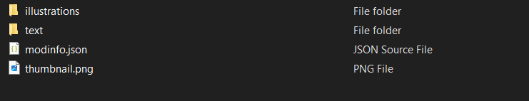
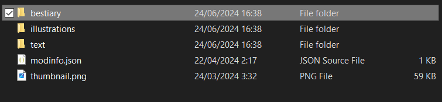
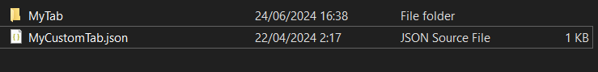
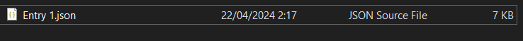

# Walkthrough
To get a grasp on the Structure of how to add your own entries, you should download the mod template [__here__](https://github.com/Oxyaine/RWBestiaryTemplate).

## Default

This walkthrough is assuming you already have your mod set up, if this isn't the case, you should set up your mod, or you can head over to the [__Modding Wiki__](https://rainworldmodding.miraheze.org/wiki/Downpour_Reference/Mod_Directories) for more information on how to mod the game.

Now that you have your mod ready to go, lets add some Bestiary entries.



Here you can see an example of the basic structure of a Rain World Mod, for this example the mod doesn't do anything, all we've got is the illustrations (sprites) folder and the text (translations) folder, + the two files required for a mod to be registered in game.

First of all lets add the `bestiary` folder into our mod, this is the only folder the Bestiary actually accesses to check for plugins, tabs, and entries, so it's necessary if you want to add anything to the Bestiary.



Now that we've added the folder, we're going to decide what tab we want our entry to be in, tabs are categories that entries are stored in, these categories are used for separating different entries, such as the base Rain World entries from Downpour entries, and so on.

To create a new tab, we'll make a folder to hold the entries that are in that tab, and a new JSON file that will tell the bestiary the tab exists.

*The names of this folder and JSON file don't matter.*



We will add two properties to our tab:
- `path` -> We have to tell the Bestiary which folder this tab uses to store its entries, this is the folder starting from your mods root directory, so in this case our folder is called `MyTab`, so we will set the `path` property to `bestiary\\MyTab`.

and
- `name` -> We also have to specify a name for our tab, if this is left blank, the bestiary will use the name of the file as the tabs name.

With the name we can do two things, we can set the name to be the same as an already existing tab, which will cause the two tabs to merge together, or we can set a unique name to create an entirely new tab; You can read more on merging tabs [__here__]().

For this example, we will create a new tab which we will call `My Tab`, just to keep things simple.

Your tabs JSON file should look something like this:
```json
{
	"name": "My Tab",
	"path": "bestiary\\MyTab"
}
```

Next



To Do

```cs

```

To Do

```cs

```

To Do


## Plugins


## Template Walkthrough
The template is a template mod, meaning its an entire Rain World mod with the Bestiary entries added in. The purpose of this template is to show how entries should be placed in your mods folder.
- To take the entries and tabs out of the template just drag the `bestiary` folder into your mod.
