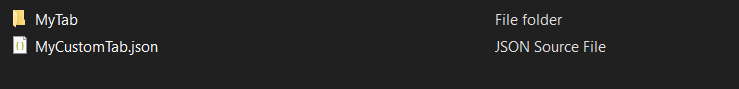
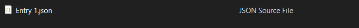

# Walkthrough
To get a grasp on the Structure of how to add your own entries, you should download the mod template [here](https://github.com/Oxyaine/RWBestiaryTemplate).

## Template
The template is a template mod, meaning its an entire Rain World mod with the Bestiary entries added in. The purpose of this template is to show how entries should be placed in your mods folder.
- To take the entries and tabs out of the template just drag the `bestiary` folder into your mod.

## Default

*To DO*


Here you can see an example of the basic structure of a Rain World Mod, in this example the mod doesn't do anything, so its perfect for a simple walkthrough.

First of all lets add the `bestiary` folder into our mod, this is the only folder the Bestiary actually accesses to check for plugins, tabs, and entries, so it's necessary if you want to add anything to the Bestiary.


Now that we've added the folder, we're going to decide what tab we want our entry to be in, you can read more on tabs [here]().
In our case we are going to make a new tab, but you can always use an existing tab that already exists (you can read more on merging tabs [here]()).
To create a new tab, we'll make a folder to hold the entries that are in that tab, and a new JSON file that will tell the bestiary the tab exists.

**The names of this folder and JSON file don't matter.*



We will add two properties to our tab:
- `name` -> which will set the name of our tab, in this case we will just set the name of our tab to `My Tab`, as an example.

and
- `path` -> We also have to tell the Bestiary which folder this tab uses to store its entries, this is the folder starting from your mods root directory, so in this case our folder is called `MyTab`, so we will set the `path` property to `bestiary\\MyTab`.

Your tabs JSON file should look something like this:
```json
{
	"name": "My Tab",
	"path": "bestiary\\MyTab"
}
```

By default, the Bestiary will automatically generate a title using the name of the tab, however, you can set a custom title with the [`title_sprite`](components/title-sprite.html) property if you want to customize it.

Next



To Do


To Do

```cs

```

To Do

```cs

```

To Do

## Plugins